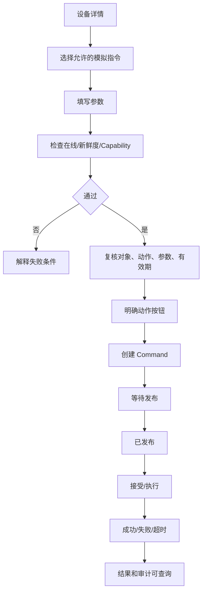

# 用户流程：创建模拟指令

```mermaid
flowchart TD
    A[设备详情] --> B[选择允许的模拟指令]
    B --> C[填写参数]
    C --> D[检查在线/新鲜度/Capability]
    D --> E{通过}
    E -->|否| F[解释失败条件]
    E -->|是| G[复核对象、动作、参数、有效期]
    G --> H[明确动作按钮]
    H --> I[创建 Command]
    I --> J[等待发布]
    J --> K[已发布]
    K --> L[接受/执行]
    L --> M[成功/失败/超时]
    M --> N[结果和审计可查询]
```
