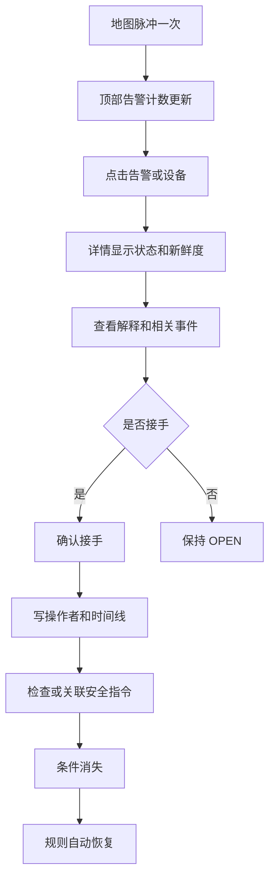

# 用户流程：处理告警

```mermaid
flowchart TD
    A[地图脉冲一次] --> B[顶部告警计数更新]
    B --> C[点击告警或设备]
    C --> D[详情显示状态和新鲜度]
    D --> E[查看解释和相关事件]
    E --> F{是否接手}
    F -->|是| G[确认接手]
    G --> H[写操作者和时间线]
    H --> I[检查或关联安全指令]
    I --> J[条件消失]
    J --> K[规则自动恢复]
    F -->|否| L[保持 OPEN]
```
