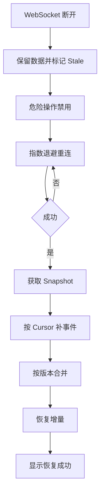

# 用户流程：连接恢复

```mermaid
flowchart TD
    A[WebSocket 断开] --> B[保留数据并标记 Stale]
    B --> C[危险操作禁用]
    C --> D[指数退避重连]
    D --> E{成功}
    E -->|否| D
    E -->|是| F[获取 Snapshot]
    F --> G[按 Cursor 补事件]
    G --> H[按版本合并]
    H --> I[恢复增量]
    I --> J[显示恢复成功]
```
