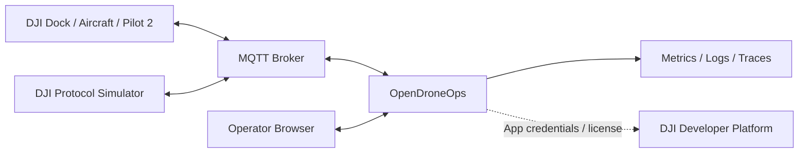

# 系统上下文



## 外部实体

- **Gateway Device**：可直接连接云并代理子设备，如 DJI Dock 或带屏遥控器。
- **Child Device**：无人机或载荷，SN 与 Gateway SN 必须区分。
- **MQTT Broker**：负责协议连接、会话和交付；不负责业务状态机。
- **浏览器**：REST 获取快照，WebSocket 接收增量。
- **DJI Developer Platform**：真实接入时创建应用并获得凭证。

## 信任边界

```text
设备公网
→ MQTT TLS / ACL
→ DJI Adapter
→ Domain
→ PostgreSQL/Redis
→ REST/WebSocket 用户边界
```
