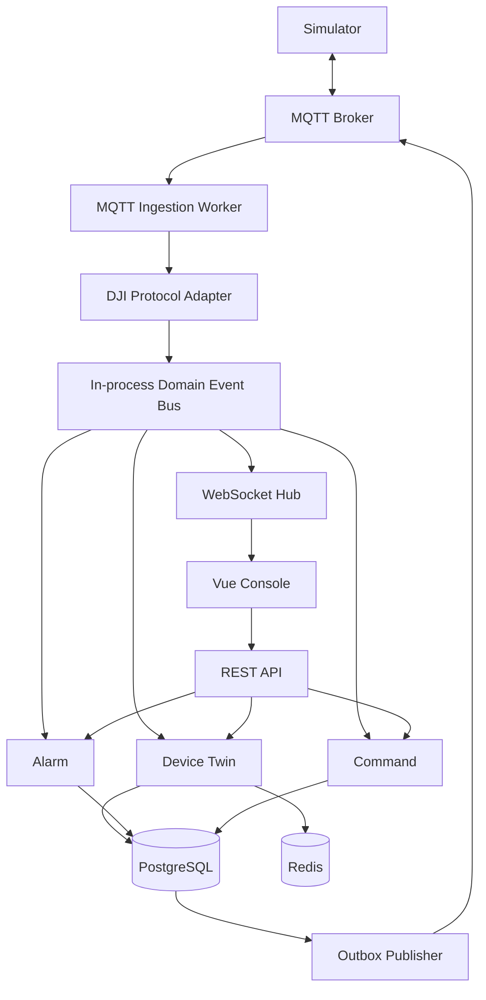

# 架构设计



## 部署单元

- `server`：REST、WebSocket 和领域模块；
- `worker`：MQTT 消费和 Outbox 发布；
- `simulator`：DJI 协议模拟。

## 上行

```text
MQTT
→ Topic Parser
→ Envelope Decode
→ Validation
→ Deduplication
→ Domain Event
→ State/Event Persistence
→ Alarm
→ WebSocket
```

## 下行

```text
REST Command
→ Authorization / Preconditions
→ Command + Outbox Transaction
→ MQTT Services
→ Services Reply / Events
→ Command Transition
→ WebSocket Notification
```

## 边界

- Domain 不导入 DJI DTO；
- Repository 不向 Handler 暴露数据库模型；
- Redis 失败不能破坏关键 DB 事务；
- 第一版 Event Bus 为进程内接口，后续可替换；
- 不在 DB 事务内调用 MQTT/HTTP。
