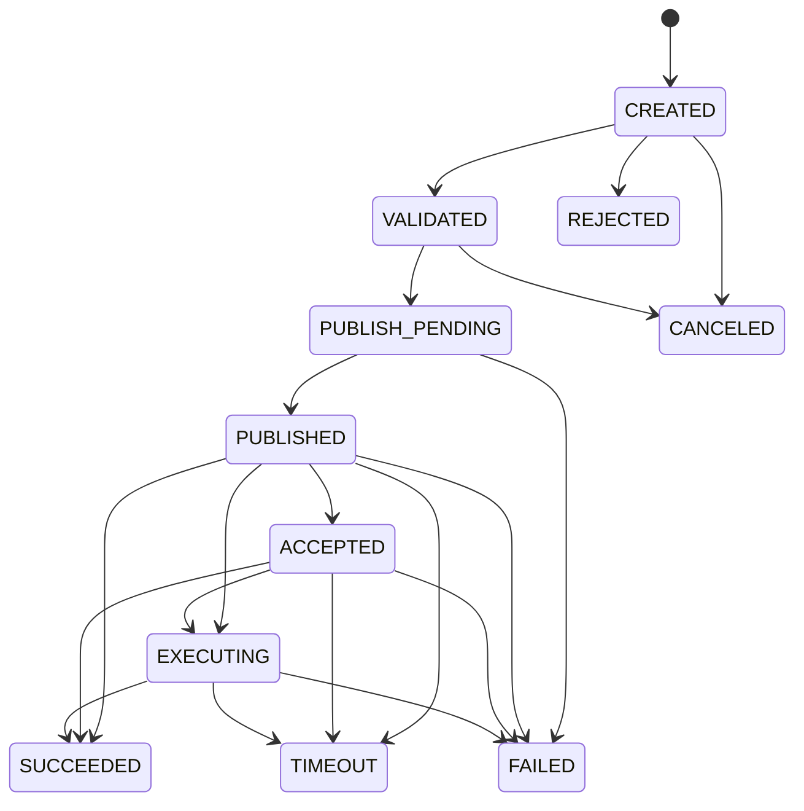

# 指令状态机

终态：`SUCCEEDED`、`FAILED`、`TIMEOUT`、`CANCELED`、`REJECTED`。

## 关联

平台：`command_id`、`idempotency_key`、请求摘要。  
DJI：`tid`、`bid`、`method`、`gateway_sn`。

Reply/Event 查找：

1. `workspace + tid + bid + method`；
2. 兼容期允许 `gateway + tid + method`；
3. 找不到写 orphan reply，不丢弃。

## 语义

- `PUBLISHED` 只表示 MQTT 发布成功；
- 每个 Method 定义接受、执行和总超时；
- 已发布但状态未知时先等待/查询，不盲目重试；
- 高风险命令不自动重试；
- API Idempotency-Key + DB 唯一约束；
- 重复 Reply/Event 的状态转换必须幂等。

MVP 只实现 LOW 风险模拟命令。
