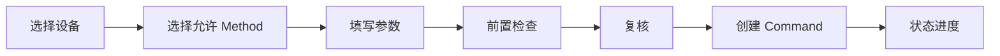

# 指令交互规格

## 原则

用户必须看见对象、动作、前置条件、有效期和结果。

## 流程



## 确认面板

显示目标设备、SN 尾号、所属 Dock、在线状态、数据新鲜度、指令、参数、风险、过期时间、可撤销性和前置条件。

按钮：

```text
返回检查
确认发送“状态刷新”到 SIM-DOCK-001
```

禁止只用“取消 / 确定”。

## 进度

```text
已创建
已验证
等待发布
已发布
设备已接受
执行中
成功 / 失败 / 超时
```

每一步显示时间、来源、解释和下一步。

## 技术关联

运维详情可展开 `command_id`、`dji_tid`、`dji_bid`、Method、Publish、Reply/Event、Result Code 和 Outbox Attempt。

## 状态未知

```text
设备结果尚未确认
平台不会自动重复发送此操作
```

提供刷新状态、查看事件、等待和授权人工判定。

## 高风险

未来使用独立页面、状态前置检查、风险说明、二次认证或双人确认、完整审计；不允许批量，也不依赖滑动或长按作为唯一安全机制。
